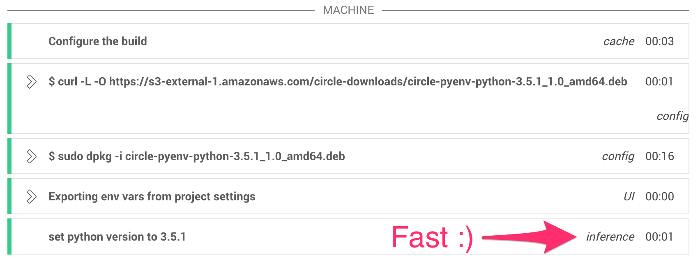

## Packaging what you want
Sometimes the specific version of your language is missing on the CircleCI container image. Although you can always request us to preinstall, unfortunately it takes some time to release a new container image.

There is one better approach, though. You can prepackage the installed version into a debian package, store somewhere, and reuse it from the next time.

This branch demonstates exactly how to do this.

## How to create package
Suppose you want to use `python 3.5.2` which is not preinstalled in the container image. You can create a test branch in one of your project, remove the existing circle.yml and put the following instead.

```
machine:
  python:
    version: 3.5.2

  environment:
    PKG_VERSION: 3.5.2
    PKG_NAME: circle-pyenv-python-$PKG_VERSION
    PKG_INSTALL_DIR: /home/ubuntu/.pyenv/versions/$PKG_VERSION

dependencies:
  override:
    - gem install fpm

test:
  override:
    - fpm -s dir -t deb -C $PKG_INSTALL_DIR --name $PKG_NAME --prefix $PKG_INSTALL_DIR .
    - cp ${PKG_NAME}_1.0_amd64.deb $CIRCLE_ARTIFACTS
```

There are few important things in the circle.ym.

The first thing is `version: 3.5.2`. When you specify uninstalled version of specific language in `machine` section, then we automatically install the version. The problem here is the installation takes a few minutes and this happens in each build which is exactly what we want to avoid.


The second thing is `fpm` command. [fpm](https://github.com/jordansissel/fpm) is a really cool tool that allows you to make package very easily. By using fpm, we can package the version already installed in `machine` section.

Finally, we copy the created debian package to `$CIRCLE_ARTIFACTS` so that you can download later.

[Here](https://circleci.com/gh/kimh/circleci-build-recipies/100#artifacts) is a build that's actually creating the package.


## How to use package
Once you created a package, then it's up to you where you store it. You can store in AWS S3 or in other cloud storage service and download it in every build.

Assuming you store the package somewhere, you can install with `dpkg` command. Here is an example circle.yml. You can see the build [here](https://circleci.com/gh/kimh/circleci-build-recipies/101).

```
machine:
  python:
    version: 3.5.2

  pre:
    - curl -L -O https://s3-external-1.amazonaws.com/circle-downloads/circle-pyenv-python-3.5.2_1.0_amd64.deb
    - sudo dpkg -i circle-pyenv-python-3.5.2_1.0_amd64.deb

dependencies:
  override:
    - exit 0

test:
  override:
    - python --version
```

`dpkg -i` command will install the python 3.5.2 in the exactly the same place where `pyenv` will install so the installation doesn't happen.



## Wrapping up
With this approach, basically you can package anything. Installing a debian package is basically the same thing as uncompressing files (with downloading overhead) so the operation is very cheap.

The downside of this approach is that we are offloading the task of creating packages to our end users. We hate to do this and we are now working on making the prepackaging very easy for our users. Hopefully we can release this very soon!!
